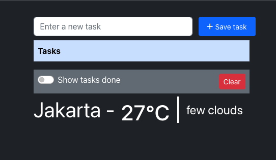

## Install Backend (1)

### Install packages
Clone the project into local open your terminal,
Install vendor using composer

```bash
composer update
```

### Configure .env
Copy .env.example file

```bash
cp .env.example .env
```

Then run the following command :

```php
php artisan key:generate
```

### Migrate Data
create an empty database with mysql 8.x version, then setup that fresh db at your .env file, then run the following command to generate all tables and seeding dummy data:

```php
php artisan migrate
```

### Running Application
To serve the laravel app, you need to run the following command in the project director (This will serve your app, and give you an adress with port number 8000 or etc)
- **Note: You need run the following command into new terminal tab**

```php
php artisan serve
```

### Documentation API
[(Click Here for POSTMAN API Documentation)](http://apimatic.io)


## Install Frontend (1)
Clone the project into local

Install all the npm packages. Go into the project folder and type the following command to install all npm packages

```bash
npm install
```

In order to run the application Type the following command

```bash
npm start
```

The Application Runs on **localhost:3000**

- 

